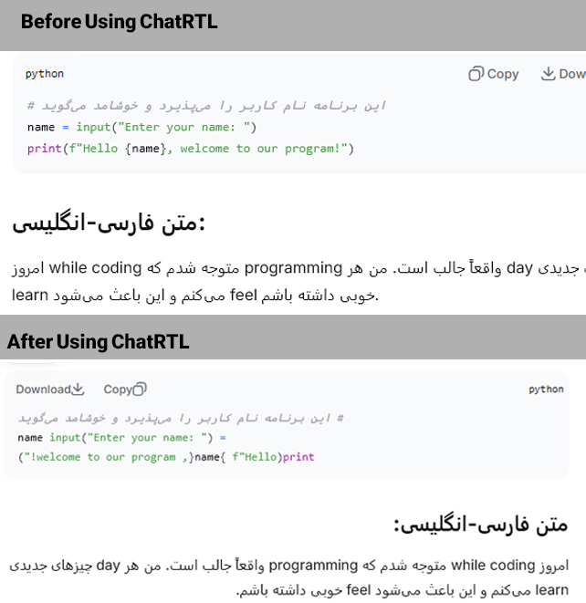

# ChatRtl

A simple userscript that fixes RTL (Persian/Arabic) text rendering in AI chatbots without breaking the layout.

## 📸 Before / After
| Before | After |
|--------|--------|
| 

## 🧩 Supported Chatbots
- ChatGPT  
- DeepSeek  
- Claude  
- Qwen  

## 🚀 Installation
1. Install a userscript manager (Tampermonkey / Violentmonkey).  
2. Install the script:  
   **[ChatRtl.user.js](https://github.com/Mahdi-Gholami81/ChatRTL/raw/refs/heads/main/ChatRtl.user.js)**

## ✨ What it does
- Forces correct RTL direction for Persian/Arabic  
- Fixes BiDi issues  
- Keeps the original UI layout intact  

## 📄 File
`ChatRtl.user.js`

---

If you find this helpful, consider starring the repository ⭐
